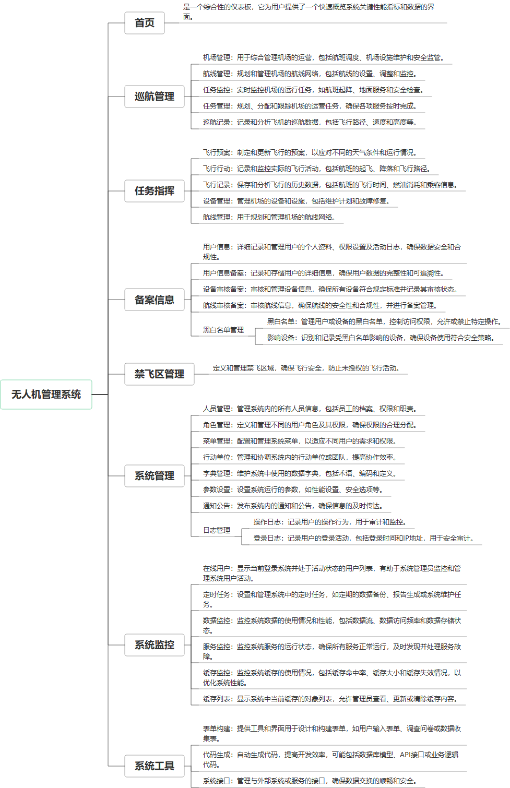

 

    
 

公司拥有上百套具有自主知识产权的软件系统，详情请查看码云首页或公司官网

 
<h1>无人机管理系统</h1>

<a href="https://www.haishi.net.cn/">公司官网</a> ｜ <a href="https://www.haishi.net.cn/">在线体验</a>

 

## 系统介绍

政府-无人机-管理平台
接入无人机开放平台，包含飞行预案、飞行行动、飞行记录、航线管理、巡航任务管理、任务监控、实施监控、禁飞区管理等功能。
政府-无人机-管理平台
接入无人机开放平台，包含飞行预案、飞行行动、飞行记录、航线管理、巡航任务管理、任务监控、实施监控、禁飞区管理等功能。
本项目名称为无人机管理系统，是一个用于管理和指挥无人机飞行任务的综合性平台。该系统提供从飞行预案制定、飞行行动指挥、飞行记录查询到设备管理、航线管理、备案信息管理等全方位的功能，旨在提高无人机飞行的安全性和效率。本项目主要面向管理端用户，提供一个集中式的管理平台。
- 管理端系统：公司内部管理员用户使用，可以进行无人机飞行任务的全面管理，包括飞行预案、飞行行动、飞行记录、设备管理、航线管理、巡航管理、备案信息管理、禁飞区域管理、系统管理等。
                

## 系统功能介绍

### 系统包含终端说明

管理端（WEB）、用户端（Android APP）

| 序号 | 模块 | 模块说明 |
| --- | --- | --- |
| 1 | ZF-WRJGL-GLPT-MANAGE | 管理端 |
| 2 | ZF-WRJGL-GLPT-SERVER | 服务端 |

### 系统功能结构

### 系统功能说明

主要功能：
* 任务指挥：
- 飞行预案：制定飞行计划，包括飞行路线、时间、任务等。
- 飞行行动：实时监控和指挥无人机飞行，可以发送指令、调整航线等。
- 飞行记录：记录每次飞行的详细信息，包括飞行轨迹、时间、任务完成情况等。
- 设备管理：管理无人机设备，包括设备信息、状态、维护记录等。
- 航线管理：管理飞行航线，包括航线规划、编辑、导入导出等。
* 巡航管理：
- 机场管理：管理无人机起降的机场信息。
- 航线管理：管理巡航航线，包括航线规划、编辑、导入导出等。
- 任务监控：实时监控巡航任务的执行情况。
- 任务管理：管理巡航任务，包括任务创建、编辑、分配等。
- 巡航记录：记录每次巡航任务的详细信息。
* 备案信息：
- 用户信息：管理用户信息，包括用户信息的增删改查。
- 用户信息备案：对用户信息进行备案管理。
- 设备审核备案：对无人机设备进行审核备案。
- 航线审核备案：对飞行航线进行审核备案。
- 黑白名单管理：管理黑白名单，对特定用户或设备进行限制。
* 禁飞区域管理：设置禁飞区域，限制无人机在特定区域飞行。
* 系统管理：
- 人员管理：管理系统用户，包括用户权限、角色分配等。
- 角色管理：管理系统角色，包括角色权限的设置。
- 菜单管理：管理系统菜单，包括菜单的增删改查。
- 行动单位：管理行动单位信息。
- 通知公告：发布通知公告信息。
- 日志管理：记录系统操作日志，方便问题追踪和审计。

## 系统主要界面

## 系统技术说明

### 代码模块说明

| 序号 | 目录 | 目录说明 |
| --- | --- | --- |
| 1 | ZF-WRJGL-GLPT-SERVER/ruoyi-generator | -- |
| 2 | ZF-WRJGL-GLPT-SERVER/ruoyi-gis | -- |
| 3 | ZF-WRJGL-GLPT-SERVER/ruoyi-quartz | -- |
| 4 | ZF-WRJGL-GLPT-SERVER/ruoyi-framework | -- |
| 5 | ZF-WRJGL-GLPT-SERVER/ruoyi-common | -- |
| 6 | ZF-WRJGL-GLPT-SERVER/ruoyi-system | -- |
| 7 | ZF-WRJGL-GLPT-SERVER/ruoyi-admin | -- |
| 8 | ZF-WRJGL-GLPT-SERVER/.idea | -- |

### 系统技术选型

#### 开发语言/框架

JAVA（JDK1.8）
脚手架：RuoYi
前端框架：VUE2
框架：SpringBoot2.x
系统结构：单体应用

#### 服务中间件

Nginx
Tomcat

#### 数据库

MySQL（5.7+）
PGSQL

#### 其他说明

AndroidAPP基于大疆SDK开发，支持安装在大疆飞控端

## 系统演示/商用

请扫码添加客服微信获取演示地址和系统详细资料。

如果您想基于无人机管理系统进行商业化交付或定制开发服务，我们提供有偿的技术服务支持，合作模式不限，欢迎沟通！

公司官网地址： <a href="https://www.haishi.net.cn/">https://www.haishi.net.cn</a>

联系客服获取专业回答。

## 使用须知

1、 本项目商用必须获得版权所有者的授权。

2、 未经允许本项目代码不允许二次出售。

